# Awesome-Customer-Data-Platform

    

## 🚀 Top Customer Data Platforms (CDP) & Open-Source Alternatives

Explore our comprehensive list of the best Customer Data Platforms (CDP). A curated guide to leading **SaaS/cloud-hosted Customer Data Platforms** (like Segment, RudderStack, Snowplow, Jitsu, mParticle, Tealium, ActionIQ, Hightouch, Census, Lytics, Bloomreach) and their **open-source/self-hosted equivalents**. 

**Open-source solutions are emphasized** for data ownership, customization, privacy, and cost efficiency.

---

## ☁️ SaaS / Cloud-Hosted Customer Data Platforms

Popular platforms for collecting, unifying, and activating customer data across sources for marketing, analytics, and personalization.

### 🌟 Leading Options

| Platform | Description | Pricing (Starting Tier) | Free Tier Limits / Trial | Company Size / Valuation |
|---|---|---|---|---|
| **[Segment](https://segment.com)** | Pioneering CDP for event collection, identity resolution, and routing to 450+ tools. | Starts at **$120/mo** (Team plan, up to 10k MTUs) | **Free forever** up to 1,000 MTUs/mo, 2 sources, 500k sync records; 14-day Team trial | $3.2B Valuation (Acquired) |
| **[RudderStack](https://rudderstack.com)** | Warehouse-native CDP with event streams, reverse ETL, and 200+ destinations. | Starts at **$265/mo** (Growth plan, 1M events/mo) | **Free forever** up to 250,000 events/mo (16+ SDKs, 5 JS transformations, 3h sync); 30-day Growth trial | $56M Funding |
| **[Hightouch](https://hightouch.com)** | Composable CDP and Reverse ETL platform syncing warehouse models to 200+ tools. | Starts at **$350/mo** (Starter tier for high-frequency syncs) | **Free forever** with 2 active syncs/mo, hourly syncs, up to 100M operations; 14-day trial | $450M Valuation |
| **[Census](https://getcensus.com)** | Reverse ETL & data activation platform (Fivetran Activations) syncing models to tools. | Starts at **$350/mo** (Starter tier) or **$5/conn** base + MAR | **Free forever** for 10 destination connections & basic syncs; 14-day free trial on Fivetran Activations | $60M Funding |
| **[Jitsu](https://jitsu.com)** | Lightweight real-time event collection and syncing platform with ClickHouse storage. | Starts at **$99/mo** (Premium plan, 5 daily active syncs, +$10/mo per extra sync) | **Free forever** up to 200,000 active events/mo (1 daily sync, unlimited captured events, free ClickHouse) | $2M Funding |
| **[Snowplow](https://snowplow.io)** | Behavioral data platform for granular, validated, first-party event pipelines. | Starts at **~$800/mo** ($30k/yr for BDP Cloud Growth tiers) | **14-day free trial** on Snowplow BDP Cloud (no credit card); Free forever self-hosted Community Edition | $50M Funding |
| **[Tealium](https://tealium.com)** | Enterprise CDP and tag management with identity resolution and data governance. | Starts at **~$1,000/mo** ($12k/yr for Data Cloud Activation; CDP tiers from $30k/yr) | **30-day proof-of-concept sandbox trial** upon enterprise demo & qualification (No permanent free tier) | $1.2B Valuation |
| **[mParticle](https://mparticle.com)** | Multi-channel CDP specializing in mobile SDKs, identity resolution, and routing. | Starts at **~$1,000/mo** ($15k/yr entry credit tier; enterprise from $60k/yr) | **30-day proof-of-concept sandbox trial** upon sales consultation (No permanent free tier) | $800M+ Valuation |
| **[Bloomreach](https://bloomreach.com)** | Commerce CDP combining unified profiles with AI personalization and campaigns. | Starts at **~$2,900/mo** ($35k/yr starting module; full platform scales to $150k+/yr) | **14-to-30-day guided evaluation / developer environment trial** upon demo (No permanent free tier) | $2.2B Valuation |
| **[Amperity](https://amperity.com)** | Enterprise CDP for AI-powered identity resolution (AmpID) and warehouse activation. | Starts at **~$8,300/mo** ($100k/yr entry tier based on "Amps" compute credits) | **30-day guided proof-of-concept pilot** with custom dataset upon enterprise qualification (No permanent free tier) | $1B+ Valuation |
| **[Treasure Data](https://treasuredata.com)** | Enterprise Customer Data Cloud for high-scale ingestion and journey orchestration. | Starts at **~$3,500/mo** ($42k/yr entry tier; enterprise scales to $200k+/yr) | **14-to-30-day guided POC sandbox** via AWS Marketplace demo / sales (No permanent free tier) | $1B+ Valuation |
| **[ActionIQ](https://actioniq.com)** | Composable enterprise CDP for audience building directly against cloud warehouses. | Starts at **~$8,300/mo** ($100k/yr entry platform tier; custom contracts up to $400k+/yr) | **30-day customized enterprise pilot / POC** upon architecture assessment (No permanent free tier) | $140M Funding |
| **[BlueConic](https://blueconic.com)** | Pure-play CDP providing unified first-party profiles and lifecycle orchestration. | Starts at **~$2,500/mo** ($30k/yr base license scaling with profile count) | **14-to-30-day testing sandbox / demo trial** provided upon qualification (No permanent free tier) | $150M+ Valuation |
| **[Simon Data](https://simondata.com)** | Snowflake-connected CDP and marketing activation platform for customer journeys. | Starts at **~$3,000/mo** ($36k/yr entry tier based on contact profiles) | **90-day assisted enterprise pilot program** or 14-day demo environment (No permanent free tier) | $60M Funding |
| **[Lytics](https://lytics.com)** | Behavioral CDP with ML-driven audience scoring and predictive modeling (Contentstack). | Starts at **~$500/mo** (Legacy Cloud tier) or custom via Contentstack DXP | **14-day free trial** / guided demo via Contentstack (Legacy Developer plan had 10k profile limit) | $40M Funding |
| **[Zeotap](https://zeotap.com)** | Privacy-first European CDP engineered for GDPR compliance and identity resolution. | Starts at **~$2,000/mo** ($24k/yr entry tier based on Monthly Active Profiles) | **14-to-30-day POC trial environment** upon sales consultation (No permanent free tier) | $90M Funding |
| **[Optimove](https://optimove.com)** | Relationship marketing CDP with predictive analytics and campaign optimization. | Starts at **~$4,000/mo** ($48k/yr base tier scaling with active customer database) | **14-day guided proof-of-concept / sandbox demo** upon consultation (No permanent free tier) | $100M+ Funding |

These platforms help centralize customer data, reduce engineering overhead, and enable omnichannel activation.

---

## 🛠️ Open-Source / Self-Hosted Alternatives

These tools give full control over data pipelines, schemas, and activations while keeping data in your infrastructure.

### 🔥 Featured Projects

- **[Snowplow](https://snowplow.io)**  — Open-source behavioral data platform for building scalable, customizable event pipelines and analytics.
- **[RudderStack](https://rudderstack.com)**  — Open-source, warehouse-native CDP. Collect events and route to warehouses/tools with Segment-compatible API.
- **[Jitsu](https://jitsu.com)**  — Open-source CDP focused on real-time data collection and syncing. Lightweight and extensible.
- **[PostHog](https://github.com/PostHog/posthog)**  — Open-source product analytics + CDP-style event collection platform with session replay and feature flags.
- **[Tracardi](https://github.com/Tracardi/tracardi)**  — Open-source customer data platform with profiling, segmentation, and journey orchestration.
- **[Multiwoven](https://github.com/Multiwoven/multiwoven)**  — Open-source Reverse ETL and composable CDP activation platform.
- **[Apache Unomi](https://unomi.apache.org)**  — Apache project for customer data and personalization engine with OASIS CDP standard compliance.

### 🌟 Additional Open-Source Tools & Composable Patterns
- **OpenTelemetry** + custom pipelines for observability and unified event collection.
- **Airbyte** or **Meltano** for broad data integration (ELT) supporting CDP-like ingestion workflows.
- Warehouse-native tools like **dbt** combined with reverse ETL for profile modeling and activation.
- **Real-time streaming components** (Kafka, Redpanda) as backbones for high-scale event ingestion.

**Frameworks for building custom systems**: The most common modern pattern is a **composable CDP**:  
**RudderStack** or **Jitsu** (or **Snowplow**) for collection → data warehouse (Snowflake/BigQuery/ClickHouse) as the source of truth → **dbt** for modeling → **Multiwoven** or **Hightouch** for activation.

---

## ⚖️ Comparison

| Aspect              | SaaS Platforms                        | Open-Source / Self-Hosted                  |
|---------------------|---------------------------------------|--------------------------------------------|
| **Cost**            | Tiered / starting from $99–$8,300+/mo | Free (only underlying infrastructure costs)|
| **Customization**   | Configuration & API limit boundaries  | Full pipeline, schema, and logic control   |
| **Data Ownership**  | Vendor-managed cloud                  | Complete control, data privacy & compliance|
| **Setup Effort**    | Turnkey integrations & managed scale  | Self-hosting & DevOps maintenance required |
| **Use Case**        | Growth teams seeking fast rollout     | Data teams, privacy-first enterprises      |

---

## 🏁 Getting Started

1. Map your data sources and destinations (warehouses, tools, activation needs).
2. Start with **RudderStack** for easy Segment migration or **Snowplow** for advanced behavioral modeling.
3. Deploy via Docker/Kubernetes and connect to your data warehouse.
4. Use reverse ETL (e.g., with open tools like **Multiwoven** or managed services like **Hightouch**) for activation.
5. Focus on governance, schema validation, and compliance.

---

## 🤝 How to Contribute

Feel free to submit PRs to expand this list with more projects, tools, or comparisons!

1. Fork the repo.
2. Add/edit entries in `README.md` (follow the table format for SaaS with pricing/free tier columns).
3. Include: name, link, concise description, starting price, and exact free tier/trial limits.
4. Submit PR with a short explanation.

⭐ Star the repo if you find it useful!

---

## ⚠️ Disclaimer

- This is a **community-curated** list — not exhaustive and not an endorsement.
- Customer Data Platforms should be evaluated for event volume pricing, identity resolution quality, destination coverage, warehouse-native capabilities, privacy/compliance features (GDPR, CCPA), and total cost of ownership.
- Open-source CDPs give full data ownership and eliminate per-MTU fees but require engineering resources for deployment, scaling, schema management, and destination maintenance.

---

## 📈 Star History

<a href="https://www.star-history.com/?repos=ishandutta2007/Awesome-Customer-Data-Platform&type=date&legend=bottom-right">
<picture>
<source media="(prefers-color-scheme: dark)" srcset="https://api.star-history.com/chart?repos=ishandutta2007/Awesome-Customer-Data-Platform&type=date&theme=dark&legend=bottom-right" />
<source media="(prefers-color-scheme: light)" srcset="https://api.star-history.com/chart?repos=ishandutta2007/Awesome-Customer-Data-Platform&type=date&legend=bottom-right" />

</picture>
</a>

---

  Made with ❤️ for data engineers, product analytics teams, growth engineers, and anyone who wants control over customer event data without proprietary lock-in.

